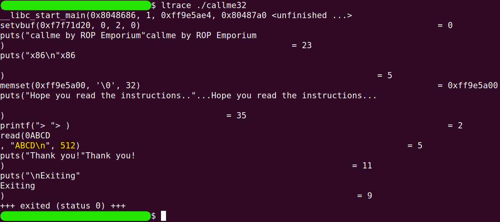

# callme
The challenge is available [here](https://ropemporium.com/challenge/callme.html).

## Black-Box Test
Let's start as usual with an initial check of the program's behavior.

```
./callme32
```


In this challenge as well, the return address is located at the same index.

```
perl -e 'print "A"x44 . "\xef\xbe\xad\xde"' | ./callme32
```

```
sudo dmesg -k | tail -2
```


Before we start exploring in more depth, let's check what the maximum input size we can enter is.

```
ltrace ./callme32
```


By entering simple input (in this case, `ABCD`) while running the program with `ltrace`, we discovered that the maximum input size we can enter is `512` bytes.

## In-depth research
It's time to note that the solution I am writing assumes that anyone reading it has already read the challenge instructions. So if any process seems strange, please refer to the instructions! :)

The goal of the challenge is to run `callme_one(0xdeadbeaf, 0xcafebabe, 0xd00df00d)`, `callme_two(0xdeadbeaf, 0xcafebabe, 0xd00df00d)`, and `callme_three(0xdeadbeaf, 0xcafebabe, 0xd00df00d)` in that order.

These functions will be imported from an external library, so during the symbol linking process, the `PLT` is involved.

Let's keep these points in mind and continue with the research we're already familiar with. First, we'll discover the functions that are written in the binary itself. (The NX protection exists in all of these challenges, and from now on, I won't mention it again)

```
rabin2 -qs callme32 | grep -ve 'imp' -e ' 0 ' -e '_'
```


We have a helper function called `usefulFunction`, just like in the previous challenge. We'll look at it later. For now, let's search for our three target functions. We can look for them in two places. The first is the `PLT`.

```
rabin2 -i callme32
```


The second is the `GOT.PLT` (again, I emphasize that anyone who hasn't read the challenge instructions should do so to understand the linkage process).

```
rabin2 -R callme32
```


To be sure where the functions reside (in both senses mentioned above), we can look at the memory segments by ranges and see the correspondence.

```
readelf -S callme32
```


