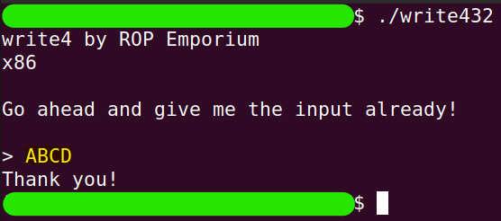
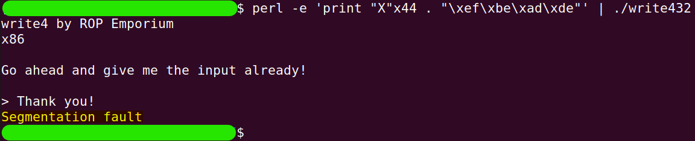
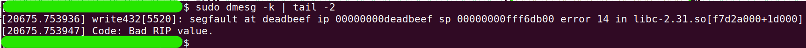
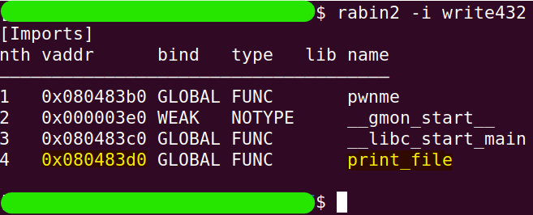
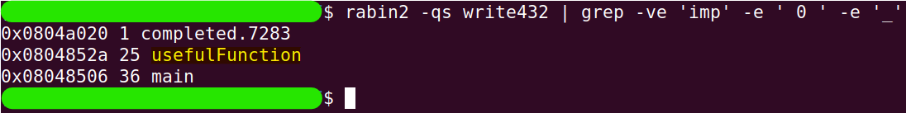
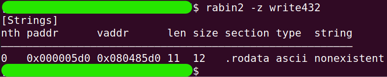
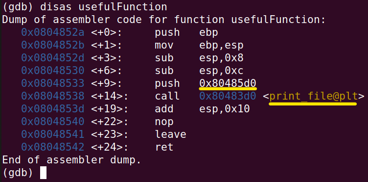

# write4
The challenge is available [here](https://ropemporium.com/challenge/write4.html).

## Black-Box Test
Like in all the challenges so far, we will also conduct a test now to discover the behavior of the software. Afterwards, we will find that the return address index is the same as in the previous challenges.

```
./write432
```

```
perl -e 'print "X"x44 . "\xef\xbe\xad\xde"' | ./write432
```

```
sudo dmesg -k | tail -2
```


## In-depth research
I assume that anyone reading this solution has already read the instructions for the challenge. We will find the address of the `print_file` function in the next command.

```
rabin2 -i write432
```


Additionally, we will also find the address of the regular helper function.

```
rabin2 -qs write432 | grep -ve 'imp' -e ' 0 ' -e '_'
```


Our goal is to make the call `print_file("flag.txt")`. Is the string "flag.txt" present in the binary? The instructions state that it is not. Let's verify this.

```
rabin2 -z write432
```


Indeed, there are no helpful strings. Let's take a look at the `usefulFunction`.

```
gdb write432
```
```
set disassembly-flavor intel
```
```
disas usefulFunction
```


To summarize, the `usefulFunction` calls `print_file` with one parameter on the stack. This parameter is the address of the string `"nonexistent"` from the previous image (you can also print it out to confirm). Therefore, `usefulFunction` executes `print_file("nonexistent")`.
