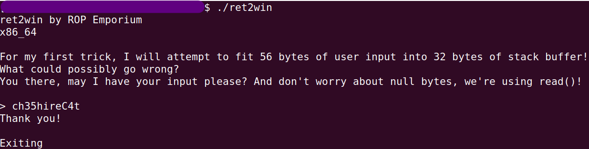

# ret2win

Let's see what the binary does:

My input was `ch35hireC4t` and the program ended.

OK. Now pay attention now to the big clue provided: **"I will attempt to fit 56 bytes of user input into 32 bytes of stack buffer"**.

Let's start investigating:
1. Is it possible to overwrite the return address easily?
2. If so, where will we direct the program?

(Remember: the goal is to print the contents of `flag.txt`)

## Exploration
### Is it possible to overwrite the return address easily?
